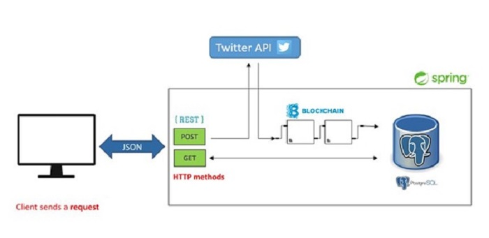

# A Real-time Tweet Analyser and Repo

## Project Description

A Restful API that retrieves specific topic related Tweets every 15 minutes from the Twitter API.

Tweets retrieved are parsed, stored in Tweet objects and persisted to a Postgres Database.

Tweets are then exposed via a GET endpoint - http://localhost:8080/api/v1/tweets

## Setup

You will have to have a Twitter Developer account and [Twitter API Keys](https://developer.twitter.com/en/docs/labs/covid19-stream/quick-start)

Set the hardcoded variables to the keys retrieved in TweetController.java

CONSUMER_KEY = [YOUR_CONSUMER_KEY]\
CONSUMER_SECRET = [YOUR_CONSUMER_SECRET]\
ACCESS_TOKEN = [YOUR_ACCESS_TOKEN]\
ACCESS_TOKEN_SECRET = [YOUR_ACCESS_TOKEN_SECRET]

You need to have the following installed:

- [Java 8](https://www.oracle.com/ie/java/technologies/javase/javase-jdk8-downloads.html)
- [PostgreSQL](https://www.postgresql.org/download/)
- [Maven](https://maven.apache.org/download.cgi)

## Run

- mvn clean install
- Start the Spring Application

